

<main class="page-shell">
  <section class="hero">
    

      Capstone Project 41 · Vision-Language-Action Robotics
      <h1>캡스톤 소개 페이지를 조금 더 읽기 좋고, 보기 좋게</h1>
      

        이 페이지는 Unitree Go2 기반 자율 로봇 프로젝트를 소개하는 랜딩 페이지입니다.
        핵심 기능, 시스템 아키텍처, 사용 장비, 팀 구성까지 한 화면에서 자연스럽게 볼 수 있도록
        카드형 레이아웃과 이미지 중심 구조로 다시 설계했습니다.
      

      

        <a class="btn btn-primary" href="#architecture">시스템 아키텍처 보기</a>
        <a class="btn btn-secondary" href="#team">팀 구성 보기</a>
      

      

        

          4
          핵심 태스크 Navigation, Pointing, Following, Backtracking
        

        

          1
          공통 VLA 기반 여러 태스크를 단일 파이프라인으로 연결
        

        

          3+
          주요 하드웨어 Go2, D435, LiDAR 등
        

        

          100%
          교체 가능 구조 이미지, 링크, 역할을 쉽게 업데이트
        

      

    

    

      

        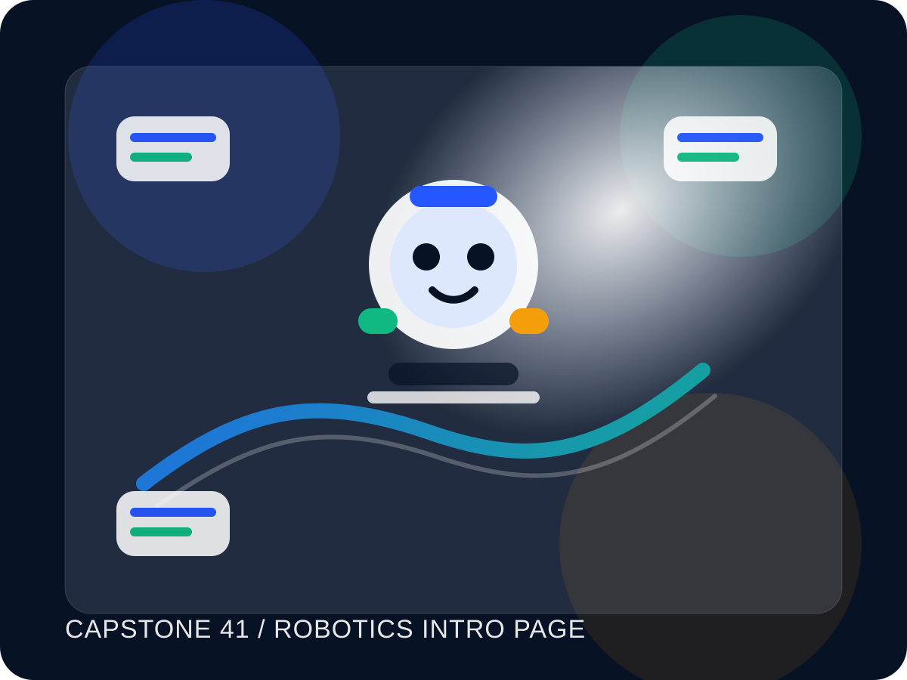
      

      

        

          <strong>한눈에 들어오는 구성</strong>
          기존의 긴 텍스트 중심 페이지를 카드와 이미지 중심으로 바꿨습니다.
        

        

          <strong>교체 쉬운 임시 이미지</strong>
          아키텍처, 팀원 사진, 장비 이미지는 나중에 실사진으로 바로 교체할 수 있습니다.
        

      

    

  </section>

  <section class="section" id="features">
    

      

        <h2>핵심 기능</h2>
        
프로젝트가 무엇을 하는지 짧고 선명하게 보여주는 섹션입니다. 각 카드마다 이미지를 배치해서 설명이 더 빨리 읽히도록 구성했습니다.

      

    

    

      <article class="feature">
        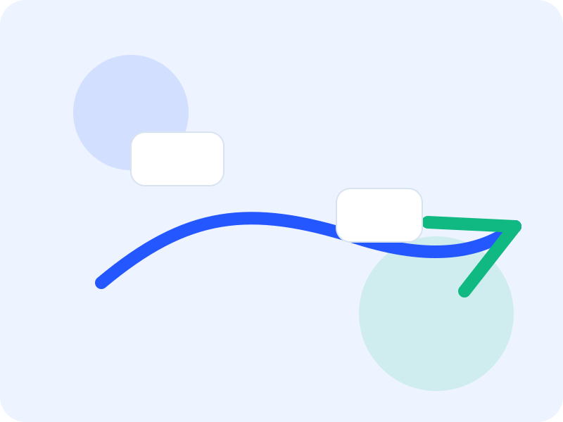
        

          <h3>Navigation</h3>
          
목표 지점을 입력하면 로봇이 환경을 이해하고 목적지까지 이동합니다.

        

      </article>
      <article class="feature">
        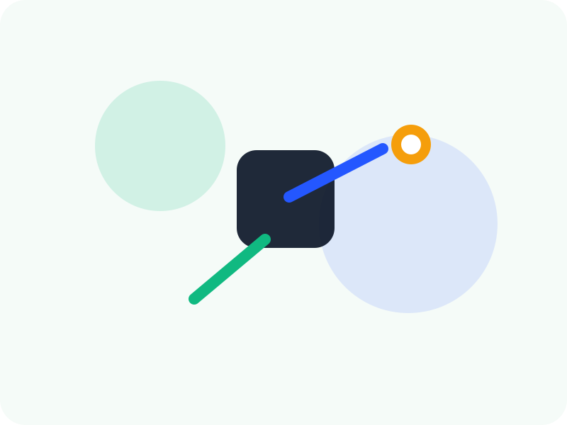
        

          <h3>Pointing</h3>
          
특정 물체를 지목하면 해당 객체를 인식하고 관련 정보를 로봇 행동에 반영합니다.

        

      </article>
      <article class="feature">
        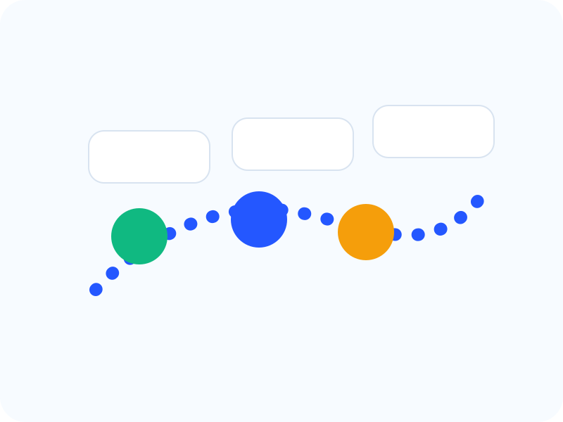
        

          <h3>Following</h3>
          
사람 또는 객체를 따라가며 주변 상황을 반영해 자연스럽게 주행합니다.

        

      </article>
      <article class="feature">
        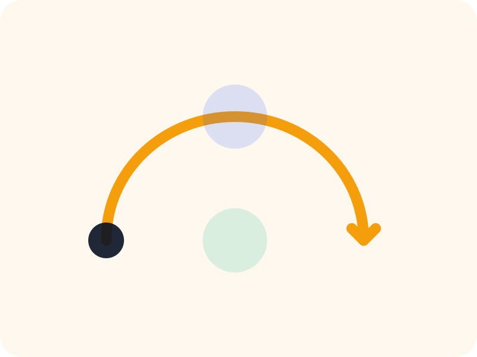
        

          <h3>Backtracking</h3>
          
지나온 경로를 복원해 되돌아가며, 실내 자율주행 시 안정성을 높입니다.

        

      </article>
    

  </section>

  <section class="section" id="architecture">
    

      

        <h2>시스템 아키텍처</h2>
        
나중에 실제 아키텍처 이미지를 넣을 수 있도록 임시 이미지를 먼저 배치했습니다. 원하는 시점에 이 이미지 파일만 교체하면 레이아웃은 그대로 유지됩니다.

      

    

    

      

        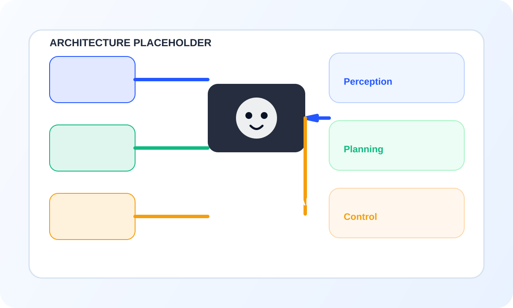
      

      

        

          <strong>왼쪽 큰 영역</strong>
          실제 아키텍처 다이어그램을 넣는 자리입니다. 발표 자료와 같은 비율로 교체하면 바로 사용 가능합니다.
        

        

          <strong>오른쪽 보조 설명</strong>
          아래 설명 박스는 모델, ROS, SLAM, LLM 연동 구조를 짧게 정리하는 용도로 쓰면 좋습니다.
        

        

          <strong>업데이트 방식</strong>
          이미지 파일만 바꾸거나 SVG를 PNG로 교체해도 페이지 구조는 그대로 유지됩니다.
        

      

    

  </section>

  <section class="section" id="equipment">
    

      

        <h2>사용 장비와 모델</h2>
        
Unitree Go2, 카메라, LiDAR 같은 실제 하드웨어 이미지를 넣어 주면 프로젝트가 훨씬 직관적으로 보입니다.

      

    

    

      <article class="device">
        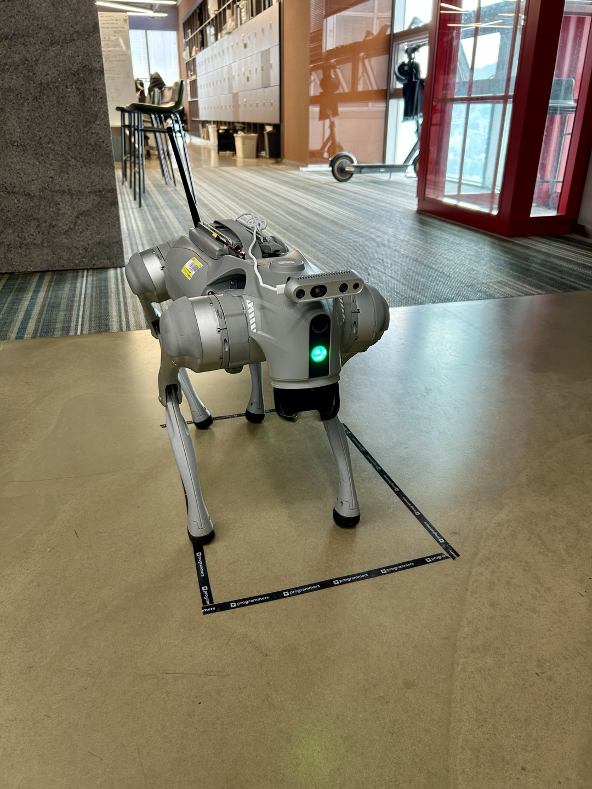
        

          <h3>Unitree Go2</h3>
          
주행 플랫폼으로 사용하는 4족 보행 로봇입니다. 실제 사진으로 교체하면 소개 페이지의 완성도가 크게 올라갑니다.

        

      </article>

      <article class="device">
        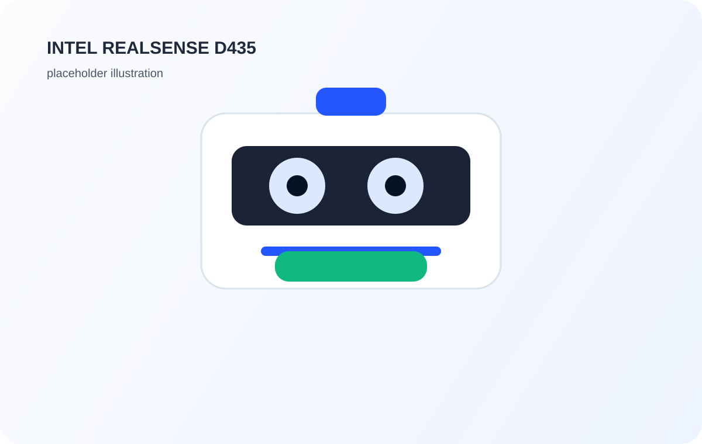
        

          <h3>Intel RealSense D435</h3>
          
RGB-D 입력을 위한 카메라입니다. 객체 인식, 거리 추정, 시각 정보 수집에 활용됩니다.

        

      </article>

      <article class="device">
        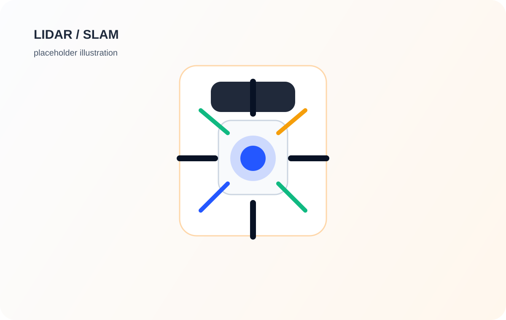
        

          <h3>LiDAR / SLAM</h3>
          
실내 위치 추정과 경로 복원에 사용되는 핵심 센서입니다. backtracking과 연동되면 설명이 더 잘 살아납니다.

        

      </article>
    

  </section>

  <section class="section" id="team">
    

      

        <h2>팀 구성과 역할</h2>
        
팀원 사진, 역할, 개인 GitHub 링크를 카드형으로 정리했습니다. 실제 이름과 링크만 바꾸면 바로 쓸 수 있게 템플릿 형태로 만들어 두었습니다.

      

    

    

      <article class="member">
        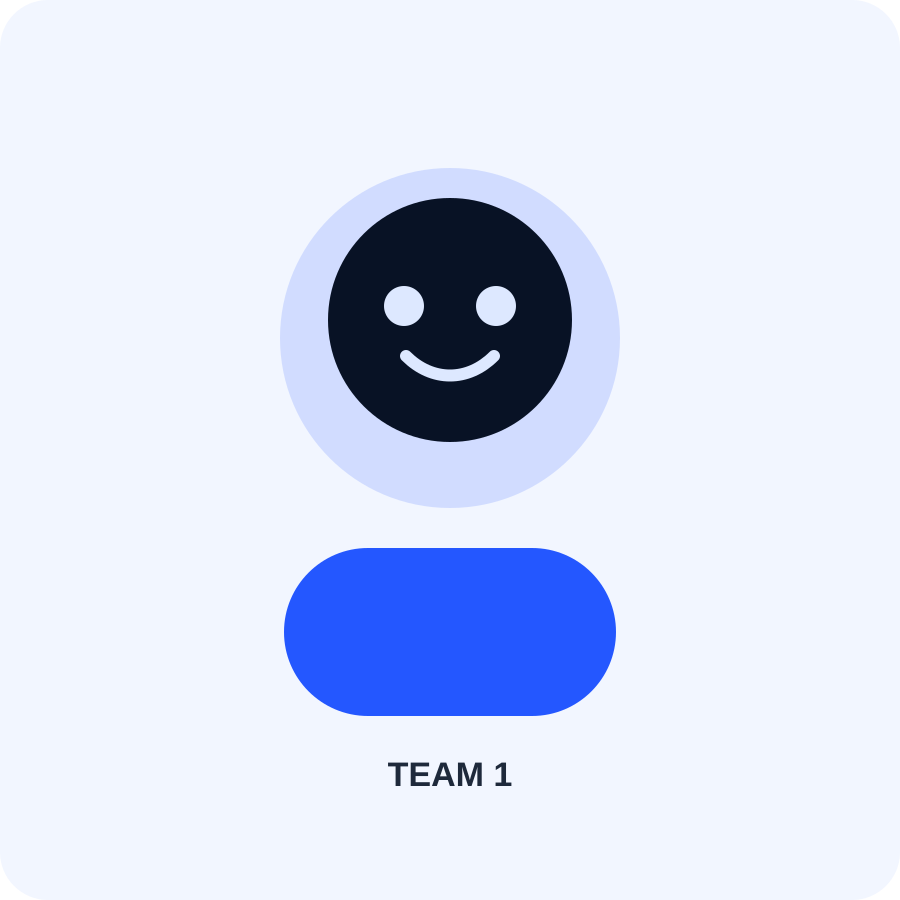
        

          <h3>팀원 1</h3>
          프로젝트 총괄
          
전체 일정 관리, 발표 구성, 시스템 통합을 담당합니다.

          <a class="link" href="https://github.com/your-github-id-1" target="_blank" rel="noreferrer">GitHub 연동</a>
        

      </article>

      <article class="member">
        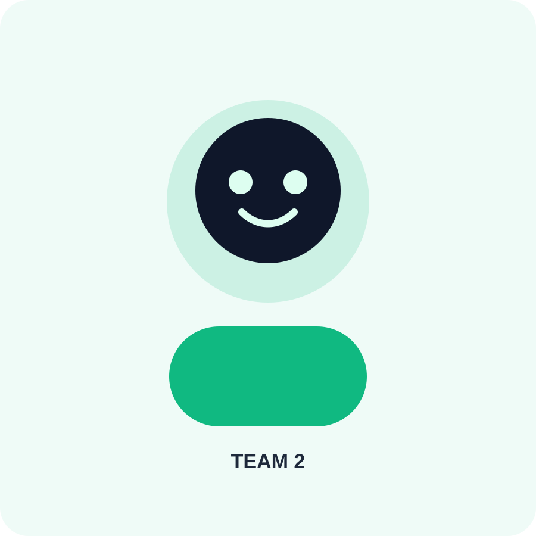
        

          <h3>팀원 2</h3>
          로봇 제어
          
Go2 제어, 주행 로직, 센서 연결 및 실기기 테스트를 담당합니다.

          <a class="link" href="https://github.com/your-github-id-2" target="_blank" rel="noreferrer">GitHub 연동</a>
        

      </article>

      <article class="member">
        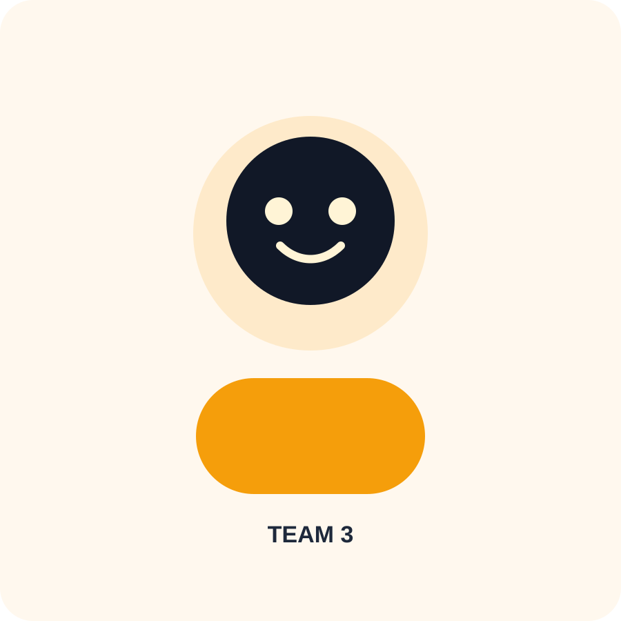
        

          <h3>팀원 3</h3>
          AI / VLA
          
VLA 모델 적용, 프롬프트 설계, 객체 인식 및 행동 생성 파트를 맡습니다.

          <a class="link" href="https://github.com/your-github-id-3" target="_blank" rel="noreferrer">GitHub 연동</a>
        

      </article>

      <article class="member">
        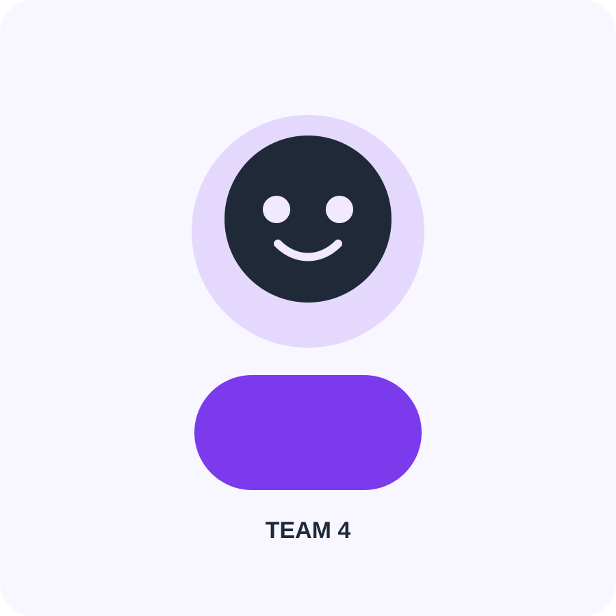
        

          <h3>팀원 4</h3>
          디자인 / 문서
          
페이지 디자인, 발표 자료 시각화, 문서 정리와 자료 아카이빙을 담당합니다.

          <a class="link" href="https://github.com/your-github-id-4" target="_blank" rel="noreferrer">GitHub 연동</a>
        

      </article>
    

    

      팀원이 4명보다 많으면 이 카드 블록을 복제해서 추가하면 됩니다. 사진은 같은 형식의 SVG를 계속 만들거나 실제 사진으로 교체할 수 있습니다.
    

  </section>

  <section class="section references">
    

      

        <h2>참고 문헌</h2>
        
논문과 모델 출처는 작게 정리해 두는 편이 소개 페이지에서는 더 깔끔합니다.

      

    

    <ol>
      <li>InternVLA-N1-DualVLN 관련 논문 및 모델 페이지</li>
      <li>LOVON 관련 논문</li>
      <li>ROSA Agent 및 Qwen 계열 참고 자료</li>
      <li>프로젝트 내부 기술 문서 및 테스트 로그</li>
    </ol>
  </section>
</main>
