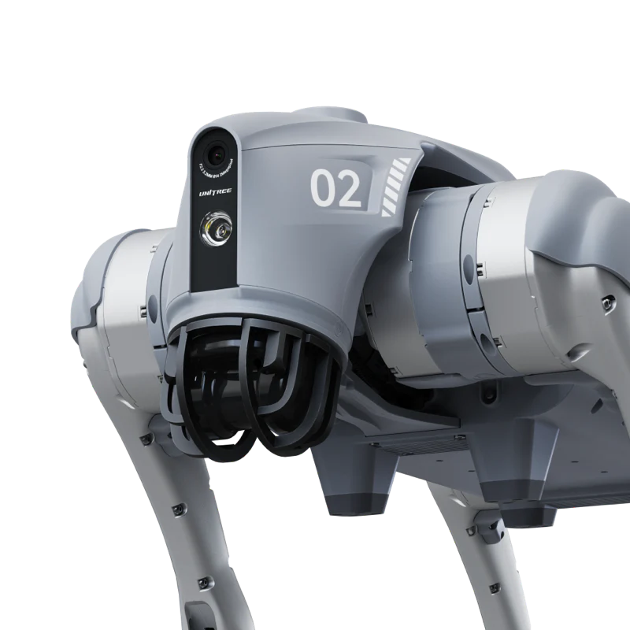
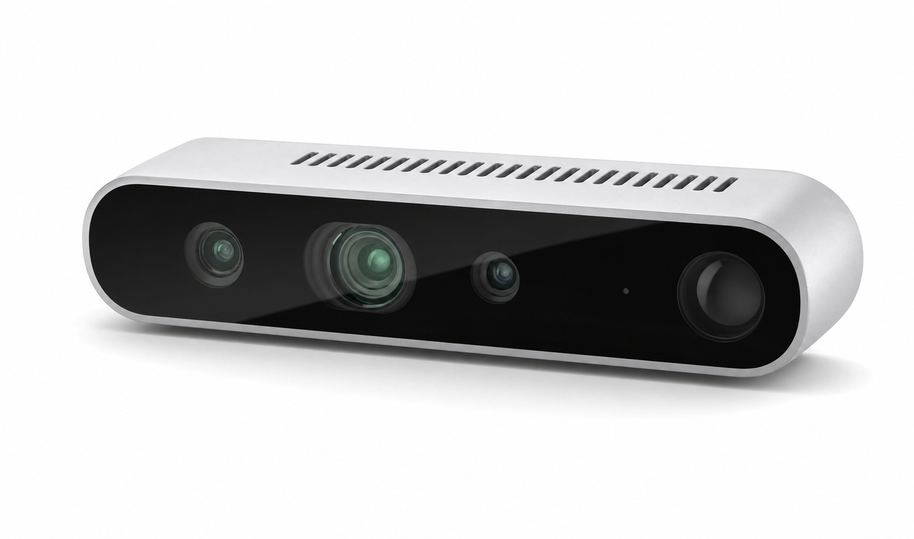
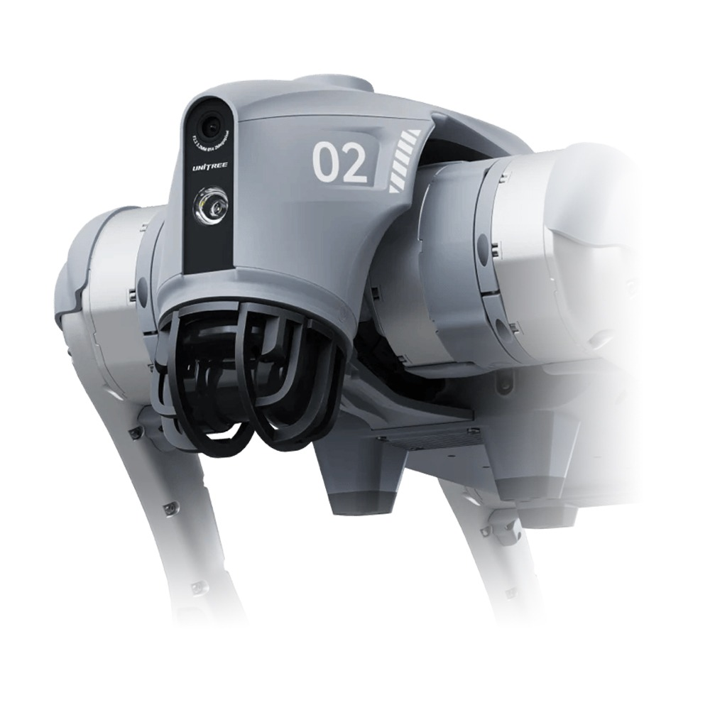

<nav class="site-nav" id="home">
  

    <a class="brand" href="#home">CAPSTONE 41</a>
    

      <a href="#home">Home</a>
      <a href="#overview">Overview</a>
      <a href="#demo">Demo</a>
      <a href="#architecture">Architecture</a>
      <a href="#stack">Tech Stack</a>
      <a href="#team">Team</a>
      <a href="https://github.com/kookmin-sw/2026-capstone-41" target="_blank" rel="noreferrer">GitHub</a>
    

  

</nav>

<header class="hero">
  

    

      

        
Vision-Language-Action 쨌 Robotics Capstone Project

        <h1>VLA 湲곕컲 ?ъ” 濡쒕큸 ?듯빀 ?먯쑉 ?쒖뒪??/h1>
        

          蹂??꾨줈?앺듃??<strong>Unitree Go2</strong> ?ъ” 蹂댄뻾 濡쒕큸??理쒖떊 Vision-Language-Action(VLA) 紐⑤뜽??<strong>InternVLA-N1-DualVLN</strong>???댁떇?섏뿬, ?щ엺??留먰븯???먯뿰??紐낅졊("?섏옄濡?媛€", "?€ ?щ엺???곕씪媛€")留뚯쑝濡?濡쒕큸???쒓컖 ?뺣낫瑜??댁꽍?섍퀬 ?ㅼ젣 ?섍꼍???먯쑉 二쇳뻾?섎룄濡?援ы쁽???꾨줈?앺듃??
        

        

          湲곗〈 VLA 紐⑤뜽?ㅼ? ?€泥대줈 ?대㉧?몄씠?쒓툒 ?쒖젏?대굹 怨좏뭹吏?移대찓???섍꼍???꾩젣濡?留뚮뱾?댁졇 ?덉뼱, ?묒? ?ъ” 濡쒕큸泥섎읆 蹂몄껜媛€ ?ㅻⅨ ?섍꼍??洹몃?濡???린硫??깅뒫???⑥뼱吏꾨떎. ?곕━ ?€?€ ?대윭??<strong>濡쒕큸 蹂몄껜蹂??섍꼍 李⑥씠</strong>瑜?蹂댁젙?섍린 ?꾪빐 LOVON???쇰? 援ъ“瑜?InternVLA??寃고빀?섍퀬, ROSA ?먯씠?꾪듃濡?紐낅졊??遺꾪빐?섎뒗 ???쒖뒪???덈꺼??媛쒖꽑???뷀뻽??
        

        

          Unitree Go2
          InternVLA-N1-DualVLN
          ROSA Agent
          LiDAR SLAM
        

        

          <a class="btn primary" href="#overview">Explore Overview</a>
          <a class="btn" href="#architecture">View Architecture</a>
        

      

    

  

</header>

<main>
  <section class="section dark" id="impact">
    

      

        

          <h2>?꾨줈?앺듃???섏쓽</h2>
        

      

      

        <article class="impact-card">
          <h3>1. ?뚰삎 ?ъ” 濡쒕큸 ?섍꼍???€??VLA Foundation Model???곸쓳</h3>
          
?€洹쒕え ?쒕??덉씠???곗씠?곕줈 ?숈뒿??理쒖떊 VLA Foundation Model?€ ?쇰컲?곸쑝濡??대㉧?몄씠?쒓툒 ?쒖젏?대굹 怨좏뭹吏?RGB-D ?섍꼍??媛€?뺥븯湲??뚮Ц?? ?쒖젏 ?믪씠媛€ ??퀬 移대찓???ъ뼇???쒗븳???뚰삎 ?ъ” 濡쒕큸??洹몃?濡?諛고룷?섎㈃ ?깅뒫???€?섎릺??蹂몄쭏???쒓퀎瑜?吏€?뚮떎. 蹂??꾨줈?앺듃??LOVON???듭떖 紐⑤뱢??InternVLA-N1-DualVLN ?대????좏깮?곸쑝濡??듯빀?⑥쑝濡쒖뜥, <strong>Foundation Model???듭㎏濡??ы븰?듯븯吏€ ?딄퀬???뚰삎 ?ъ” 濡쒕큸 蹂몄껜???곸쓳(domain adaptation)?쒗궎???ㅼ슜??寃쎈줈</strong>瑜??쒖떆?덈떎. ?대뒗 理쒖떊 ?€洹쒕え VLA 紐⑤뜽???€鍮꾩슜 濡쒕큸 ?뚮옯?쇱뿉 ?댁떇?섎젮???꾩냽 ?곌뎄쨌媛쒕컻??吏곸젒 ?쒖슜 媛€?ν븳 諛⑸쾿濡좎쟻 湲곗뿬濡??됯??쒕떎.

        </article>
        <article class="impact-card">
          <h3>2. ?⑥씪 task ?쒖뿰???섏뼱??硫€?고깭?ㅽ겕 ?듯빀 ?뚯씠?꾨씪??/h3>
          
?ㅽ뵂?뚯뒪 InternVLA??怨듦컻 ?쒖뿰???⑥씪 navigation task??癒몃Ъ???덈뒗 寃껉낵 ?щ━, 蹂??쒖뒪?쒖? <strong>Navigation, Pointing, Following, Backtracking 4醫?task瑜?ROSA 湲곕컲 LLM ?먯씠?꾪듃 ?꾩뿉 ?⑥씪 ?뚯씠?꾨씪?몄쑝濡??듯빀</strong>?덈떎. ?뱁엳 LiDAR SLAM closed-loop 湲곕컲 ?먯쑉 諛깊듃?섑궧?€ InternVLA媛€ 蹂몃옒 ?ㅻ（吏€ ?딅뒗 湲곕뒫???쒖뒪???덈꺼?먯꽌 ?뺤옣???щ?濡? foundation model???묒슜 task濡??뺤옣?섎뒗 援ъ껜???ㅺ퀎 ?덉떆瑜??쒓났?쒕떎.

        </article>
        <article class="impact-card">
          <h3>3. ?먯뿰??湲곕컲 ?먭꺽 濡쒕큸 ?댁슜 ?명꽣?섏씠??/h3>
          
?먯껜 媛쒕컻??<strong>Go2 Monitor ???명꽣?섏씠??/strong>?€ <strong>Zenoh-bridge 湲곕컲 臾댁꽑 ROS2 ?듭떊 ?ㅽ깮</strong>??寃고빀?⑥쑝濡쒖뜥, <strong>?명꽣???곌껐留??덉쑝硫??먭꺽吏€?먯꽌??濡쒕큸???ㅼ떆媛?移대찓???쇰뱶瑜??뺤씤?섍퀬 ?먯뿰??紐낅졊???꾩넚쨌?ㅽ뻾</strong>?쒗궗 ???덈뒗 援ъ“瑜??꾩꽦?덈떎. ?대뒗 ?ъ” 濡쒕큸???쒖슜 踰붿쐞瑜??곌뎄???곕え瑜??섏뼱 <strong>?щ엺??吏곸젒 ?묎렐???쒗븳?섎뒗 ?먭꺽吏€쨌?꾪뿕 ?섍꼍쨌臾댁씤 ?쒖꽕</strong> ???ㅼ젣 ?댁슜 ?쒕굹由ъ삤濡??뺤옣?????덈뒗 湲곕컲???쒓났?섎ʼn, 鍮꾩쟾臾멸????먯뿰?대쭔?쇰줈 濡쒕큸???댁슜?????덈떎???먯뿉??HRI(Human-Robot Interaction) 痢〓㈃??吏꾩엯 ?λ꼍???ш쾶 ??텣 湲곗뿬濡??됯??쒕떎.

        </article>
      

    

  </section>

  <section class="section light" id="overview">
    

      

        

          <h2>Overview</h2>
        

      

      

        <figure class="card-shell media tall">
          
        </figure>
        

          <h3>?먯뿰??紐낅졊?쇰줈 ?€吏곸씠??VLA 湲곕컲 ?ъ” 濡쒕큸</h3>
          
蹂??꾨줈?앺듃??<strong>Unitree Go2</strong> ?ъ” 蹂댄뻾 濡쒕큸??理쒖떊 Vision-Language-Action(VLA) 紐⑤뜽??<strong>InternVLA-N1-DualVLN</strong>???댁떇?섏뿬, ?щ엺??留먰븯???먯뿰??紐낅졊("?섏옄濡?媛€", "?€ ?щ엺???곕씪媛€")留뚯쑝濡?濡쒕큸???쒓컖 ?뺣낫瑜??댁꽍?섍퀬 ?ㅼ젣 ?섍꼍???먯쑉 二쇳뻾?섎룄濡?援ы쁽???꾨줈?앺듃??

          
湲곗〈 VLA 紐⑤뜽?ㅼ? ?€泥대줈 ?대㉧?몄씠?쒓툒 ?쒖젏?대굹 怨좏뭹吏?移대찓???섍꼍???꾩젣濡?留뚮뱾?댁졇 ?덉뼱, ?묒? ?ъ” 濡쒕큸泥섎읆 蹂몄껜媛€ ?ㅻⅨ ?섍꼍??洹몃?濡???린硫??깅뒫???⑥뼱吏꾨떎. ?곕━ ?€?€ ?대윭??<strong>濡쒕큸 蹂몄껜蹂??섍꼍 李⑥씠</strong>瑜?蹂댁젙?섍린 ?꾪빐 LOVON???쇰? 援ъ“瑜?InternVLA??寃고빀?섍퀬, ROSA ?먯씠?꾪듃濡?紐낅졊??遺꾪빐?섎뒗 ???쒖뒪???덈꺼??媛쒖꽑???뷀뻽??

          

            <a class="btn" href="#hardware">Hardware</a>
            <a class="btn" href="https://github.com/kookmin-sw/2026-capstone-41" target="_blank" rel="noreferrer">GitHub</a>
          

        

      

      

        <article class="mini-card">
          <h4>Navigation</h4>
          
?먯뿰??紐낅졊??諛쏆븘 ?섍꼍 ??紐⑺몴 吏€?먭퉴吏€ ?먯쑉 二쇳뻾?쒕떎. InternVLA-N1-DualVLN??移대찓???대?吏€?€ 紐낅졊???숈떆???댁꽍??pixel goal??異쒕젰?섎㈃, 濡쒕큸??洹몄뿉 留욎떠 ?대룞?쒕떎.

        </article>
        <article class="mini-card">
          <h4>Pointing</h4>
          
?대?吏€ ???뱀젙 媛앹껜瑜?吏€?쒗븯硫?濡쒕큸???대떦 媛앹껜濡??ν븳?? 媛앹껜 吏€???뺣낫瑜?pixel goal濡?蹂€?섑빐 InternVLA???꾨떖?섎뒗 諛⑹떇?대떎.

        </article>
        <article class="mini-card">
          <h4>Following</h4>
          
?щ엺?대굹 臾쇱껜瑜?吏€?띿쟻?쇰줈 異붿쥌?쒕떎. YOLO 媛앹껜 寃€異?寃곌낵瑜?pixel goal ?낅젰?쇰줈 ?ъ슜?섎ʼn, LOVON???쇰? 援ъ“瑜?李⑥슜??紐⑥뀡 釉붾윭쨌?€??異붿쥌 ?섍꼍?먯꽌???덉젙?곸쑝濡??숈옉?섎룄濡?媛쒖꽑?덈떎.

        </article>
        <article class="mini-card">
          <h4>Backtracking</h4>
          
LiDAR SLAM 湲곕컲 closed-loop ?쒖뼱濡?怨쇨굅??吏€?섏삩 寃쎈줈瑜??먮룞?쇰줈 ?섏쭦???뚯븘?⑤떎.

        </article>
      

    

  </section>

  <section class="section light" id="demo">
    

      

        

          <h2>Demo</h2>
        

      

      

        <figure class="card-shell media tall">
          <video controls playsinline preload="metadata" poster="./image/go2_front.png">
            <source src="./video/demo.mp4" type="video/mp4">
            Your browser does not support the video tag.
          </video>
        </figure>
        

          <h3>Project Demo Video</h3>
          
?ш린???곕え ?곸긽???ｌ쓣 ???덉뒿?덈떎. <code>./video/demo.mp4</code> 寃쎈줈???ㅼ젣 ?뚯씪???먮㈃ 諛붾줈 ?ъ깮?⑸땲??

          
?쒖뿰?먯꽌??VLA navigation, pointing, following, backtracking ?먮쫫??蹂댁뿬二쇰뒗 援ъ꽦?????댁슱由쎈땲??

        

      

    

  </section>

  <section class="section dark" id="team">
    

      

        

          <h2>Team</h2>
        

      

      

        <article class="team-card">
          

            
          

          <h3>?꾨???/h3>
          
Role TBD

          <a class="gh" href="https://github.com/dla020501" target="_blank" rel="noreferrer">
            <svg viewBox="0 0 16 16" aria-hidden="true" focusable="false"><path d="M8 0C3.58 0 0 3.58 0 8c0 3.54 2.29 6.53 5.47 7.59.4.07.55-.17.55-.38 0-.19-.01-.82-.01-1.49-2.01.37-2.53-.49-2.69-.94-.09-.23-.48-.94-.82-1.13-.28-.15-.68-.52-.01-.53.63-.01 1.08.58 1.23.82.72 1.21 1.87.87 2.33.66.07-.52.28-.87.5-1.07-1.76-.2-3.62-.88-3.62-3.91 0-.86.31-1.57.82-2.13-.08-.2-.36-1.02.08-2.12 0 0 .67-.21 2.2.82a7.65 7.65 0 0 1 2-.27c.68 0 1.36.09 2 .27 1.53-1.04 2.2-.82 2.2-.82.44 1.1.16 1.92.08 2.12.51.56.82 1.26.82 2.13 0 3.04-1.86 3.7-3.63 3.9.29.25.54.73.54 1.48 0 1.07-.01 1.93-.01 2.2 0 .21.15.46.55.38A8.01 8.01 0 0 0 16 8c0-4.42-3.58-8-8-8Z"/></svg>
            GitHub
          </a>
        </article>
        <article class="team-card">
          

            
          

          <h3>議곗썝??/h3>
          
Role TBD

          <a class="gh" href="https://github.com/Reveroftrillion" target="_blank" rel="noreferrer">
            <svg viewBox="0 0 16 16" aria-hidden="true" focusable="false"><path d="M8 0C3.58 0 0 3.58 0 8c0 3.54 2.29 6.53 5.47 7.59.4.07.55-.17.55-.38 0-.19-.01-.82-.01-1.49-2.01.37-2.53-.49-2.69-.94-.09-.23-.48-.94-.82-1.13-.28-.15-.68-.52-.01-.53.63-.01 1.08.58 1.23.82.72 1.21 1.87.87 2.33.66.07-.52.28-.87.5-1.07-1.76-.2-3.62-.88-3.62-3.91 0-.86.31-1.57.82-2.13-.08-.2-.36-1.02.08-2.12 0 0 .67-.21 2.2.82a7.65 7.65 0 0 1 2-.27c.68 0 1.36.09 2 .27 1.53-1.04 2.2-.82 2.2-.82.44 1.1.16 1.92.08 2.12.51.56.82 1.26.82 2.13 0 3.04-1.86 3.7-3.63 3.9.29.25.54.73.54 1.48 0 1.07-.01 1.93-.01 2.2 0 .21.15.46.55.38A8.01 8.01 0 0 0 16 8c0-4.42-3.58-8-8-8Z"/></svg>
            GitHub
          </a>
        </article>
        <article class="team-card">
          

            
          

          <h3>?뺤쑀吏?/h3>
          
Role TBD

          <a class="gh" href="https://github.com/alicex-x02" target="_blank" rel="noreferrer">
            <svg viewBox="0 0 16 16" aria-hidden="true" focusable="false"><path d="M8 0C3.58 0 0 3.58 0 8c0 3.54 2.29 6.53 5.47 7.59.4.07.55-.17.55-.38 0-.19-.01-.82-.01-1.49-2.01.37-2.53-.49-2.69-.94-.09-.23-.48-.94-.82-1.13-.28-.15-.68-.52-.01-.53.63-.01 1.08.58 1.23.82.72 1.21 1.87.87 2.33.66.07-.52.28-.87.5-1.07-1.76-.2-3.62-.88-3.62-3.91 0-.86.31-1.57.82-2.13-.08-.2-.36-1.02.08-2.12 0 0 .67-.21 2.2.82a7.65 7.65 0 0 1 2-.27c.68 0 1.36.09 2 .27 1.53-1.04 2.2-.82 2.2-.82.44 1.1.16 1.92.08 2.12.51.56.82 1.26.82 2.13 0 3.04-1.86 3.7-3.63 3.9.29.25.54.73.54 1.48 0 1.07-.01 1.93-.01 2.2 0 .21.15.46.55.38A8.01 8.01 0 0 0 16 8c0-4.42-3.58-8-8-8Z"/></svg>
            GitHub
          </a>
        </article>
        <article class="team-card">
          

            
          

          <h3>?깆옱??/h3>
          
Role TBD

          <a class="gh" href="https://github.com/Sung-Jae-Seong" target="_blank" rel="noreferrer">
            <svg viewBox="0 0 16 16" aria-hidden="true" focusable="false"><path d="M8 0C3.58 0 0 3.58 0 8c0 3.54 2.29 6.53 5.47 7.59.4.07.55-.17.55-.38 0-.19-.01-.82-.01-1.49-2.01.37-2.53-.49-2.69-.94-.09-.23-.48-.94-.82-1.13-.28-.15-.68-.52-.01-.53.63-.01 1.08.58 1.23.82.72 1.21 1.87.87 2.33.66.07-.52.28-.87.5-1.07-1.76-.2-3.62-.88-3.62-3.91 0-.86.31-1.57.82-2.13-.08-.2-.36-1.02.08-2.12 0 0 .67-.21 2.2.82a7.65 7.65 0 0 1 2-.27c.68 0 1.36.09 2 .27 1.53-1.04 2.2-.82 2.2-.82.44 1.1.16 1.92.08 2.12.51.56.82 1.26.82 2.13 0 3.04-1.86 3.7-3.63 3.9.29.25.54.73.54 1.48 0 1.07-.01 1.93-.01 2.2 0 .21.15.46.55.38A8.01 8.01 0 0 0 16 8c0-4.42-3.58-8-8-8Z"/></svg>
            GitHub
          </a>
        </article>
        <article class="team-card">
          

            
          

          <h3>議곗쑀鍮?/h3>
          
Role TBD

          <a class="gh" href="https://github.com/yubincho3" target="_blank" rel="noreferrer">
            <svg viewBox="0 0 16 16" aria-hidden="true" focusable="false"><path d="M8 0C3.58 0 0 3.58 0 8c0 3.54 2.29 6.53 5.47 7.59.4.07.55-.17.55-.38 0-.19-.01-.82-.01-1.49-2.01.37-2.53-.49-2.69-.94-.09-.23-.48-.94-.82-1.13-.28-.15-.68-.52-.01-.53.63-.01 1.08.58 1.23.82.72 1.21 1.87.87 2.33.66.07-.52.28-.87.5-1.07-1.76-.2-3.62-.88-3.62-3.91 0-.86.31-1.57.82-2.13-.08-.2-.36-1.02.08-2.12 0 0 .67-.21 2.2.82a7.65 7.65 0 0 1 2-.27c.68 0 1.36.09 2 .27 1.53-1.04 2.2-.82 2.2-.82.44 1.1.16 1.92.08 2.12.51.56.82 1.26.82 2.13 0 3.04-1.86 3.7-3.63 3.9.29.25.54.73.54 1.48 0 1.07-.01 1.93-.01 2.2 0 .21.15.46.55.38A8.01 8.01 0 0 0 16 8c0-4.42-3.58-8-8-8Z"/></svg>
            GitHub
          </a>
        </article>
        <article class="team-card">
          

            
          

          <h3>?좊━??/h3>
          
Role TBD

          <a class="gh" href="https://github.com/ryurian001" target="_blank" rel="noreferrer">
            <svg viewBox="0 0 16 16" aria-hidden="true" focusable="false"><path d="M8 0C3.58 0 0 3.58 0 8c0 3.54 2.29 6.53 5.47 7.59.4.07.55-.17.55-.38 0-.19-.01-.82-.01-1.49-2.01.37-2.53-.49-2.69-.94-.09-.23-.48-.94-.82-1.13-.28-.15-.68-.52-.01-.53.63-.01 1.08.58 1.23.82.72 1.21 1.87.87 2.33.66.07-.52.28-.87.5-1.07-1.76-.2-3.62-.88-3.62-3.91 0-.86.31-1.57.82-2.13-.08-.2-.36-1.02.08-2.12 0 0 .67-.21 2.2.82a7.65 7.65 0 0 1 2-.27c.68 0 1.36.09 2 .27 1.53-1.04 2.2-.82 2.2-.82.44 1.1.16 1.92.08 2.12.51.56.82 1.26.82 2.13 0 3.04-1.86 3.7-3.63 3.9.29.25.54.73.54 1.48 0 1.07-.01 1.93-.01 2.2 0 .21.15.46.55.38A8.01 8.01 0 0 0 16 8c0-4.42-3.58-8-8-8Z"/></svg>
            GitHub
          </a>
        </article>
      

    

  </section>

    <section class="section light timeline-section" id="timeline">
    

      

        
Timeline

        <h2>罹≪뒪??媛쒕컻 ?€?꾨씪??/h2>
        
3?붾???5?붽퉴吏€??二쇱슂 媛쒕컻 怨꾪쉷怨?吏꾪뻾 怨쇱젣

      

      

        
        
        
        

        <article class="timeline-entry timeline-entry-1">
          

            <h3>
              
                <svg viewBox="0 0 16 16" aria-hidden="true" focusable="false">
                  <path d="M4 0a1 1 0 0 1 1 1v1h6V1a1 1 0 1 1 2 0v1h1.5A1.5 1.5 0 0 1 16 3.5v11A1.5 1.5 0 0 1 14.5 16h-13A1.5 1.5 0 0 1 0 14.5v-11A1.5 1.5 0 0 1 1.5 2H3V1a1 1 0 0 1 1-1Zm-2 6v8.5c0 .28.22.5.5.5h11c.28 0 .5-.22.5-.5V6H2Zm12-2V3.5a.5.5 0 0 0-.5-.5H14v1a1 1 0 1 1-2 0V3H4v1a1 1 0 1 1-2 0V3h-.5a.5.5 0 0 0-.5.5V4h13Z"/>
                </svg>
                3??/span>
              
            </h3>
            <ul class="timeline-list">
              <li>諛⑺뼢??寃곗젙</li>
              <li>ROS2 / Zenoh</li>
              <li>InternVLA / LOVON ?ы쁽</li>
              <li>1李??쒖뿰</li>
            </ul>
          

        </article>

        <article class="timeline-entry timeline-entry-2">
          

            <h3>
              
                <svg viewBox="0 0 16 16" aria-hidden="true" focusable="false">
                  <path d="M4 0a1 1 0 0 1 1 1v1h6V1a1 1 0 1 1 2 0v1h1.5A1.5 1.5 0 0 1 16 3.5v11A1.5 1.5 0 0 1 14.5 16h-13A1.5 1.5 0 0 1 0 14.5v-11A1.5 1.5 0 0 1 1.5 2H3V1a1 1 0 0 1 1-1Zm-2 6v8.5c0 .28.22.5.5.5h11c.28 0 .5-.22.5-.5V6H2Zm12-2V3.5a.5.5 0 0 0-.5-.5H14v1a1 1 0 1 1-2 0V3H4v1a1 1 0 1 1-2 0V3h-.5a.5.5 0 0 0-.5.5V4h13Z"/>
                </svg>
                4??/span>
              
            </h3>
            <ul class="timeline-list">
              <li>Following 寃고빀</li>
              <li>LOVON ?쇰? 援ъ“ 李⑥슜</li>
              <li>?붾툝?щ쭅</li>
              <li>LiDAR SLAM</li>
              <li>Backtracking</li>
            </ul>
          

        </article>

        <article class="timeline-entry timeline-entry-3">
          

            <h3>
              
                <svg viewBox="0 0 16 16" aria-hidden="true" focusable="false">
                  <path d="M4 0a1 1 0 0 1 1 1v1h6V1a1 1 0 1 1 2 0v1h1.5A1.5 1.5 0 0 1 16 3.5v11A1.5 1.5 0 0 1 14.5 16h-13A1.5 1.5 0 0 1 0 14.5v-11A1.5 1.5 0 0 1 1.5 2H3V1a1 1 0 0 1 1-1Zm-2 6v8.5c0 .28.22.5.5.5h11c.28 0 .5-.22.5-.5V6H2Zm12-2V3.5a.5.5 0 0 0-.5-.5H14v1a1 1 0 1 1-2 0V3H4v1a1 1 0 1 1-2 0V3h-.5a.5.5 0 0 0-.5.5V4h13Z"/>
                </svg>
                5??/span>
              
            </h3>
            <ul class="timeline-list">
              <li>Pointing 異붽?</li>
              <li>?꾩껜 肄붾뱶 蹂묓빀</li>
              <li>ROSA + Qwen3.5-4B ?곌껐</li>
              <li>ROS2 ?꾧뎄 媛쒖꽑</li>
              <li>Task Planner ?듯빀</li>
              <li>?뺣웾 ?됯?</li>
              <li>?쇰Ц 珥덉븞</li>
            </ul>
          

        </article>

        

      

    

  </section>
  <section class="section dark" id="stack">
    

      

        

          <h2>Tech Stack</h2>
        

      

      

        <h3>Hardware</h3>
      

      

        <article class="hardware-card">
          <figure>
            
          </figure>
          

            <h3>Unitree Go2</h3>
            
4諛?蹂댄뻾 濡쒕큸, ?댁옣 Jetson Orin / ?댁옣 LiDAR

          

        </article>
        <article class="hardware-card">
          <figure>
            
          </figure>
          

            <h3>Intel RealSense D435</h3>
            
RGB-D 移대찓??/p>
          

        </article>
        <article class="hardware-card">
          <figure>
            
          </figure>
          

            <h3>RTX 3090</h3>
            
紐⑤뜽 異붾줎 諛??ㅽ뿕 ?섍꼍

          

        </article>
        <article class="hardware-card">
          <figure>
            
          </figure>
          

            <h3>LiDAR</h3>
            
二쇳뻾 ?덉젙?깃낵 ?섍꼍 ?몄?瑜??꾪븳 嫄곕━ ?쇱꽌

          

        </article>
      

      

        <h3>Software / Models</h3>
      

      

        <article class="stack-card">
          <h3>Models / AI</h3>
          <ul class="stack-list">
            <li>InternVLA-N1-DualVLN</li>
            <li>LOVON</li>
            <li>Qwen3.5-4B</li>
            <li>YOLO</li>
          </ul>
        </article>
        <article class="stack-card">
          <h3>Software</h3>
          <ul class="stack-list">
            <li>Python + PyTorch</li>
            <li>OpenCV / NumPy</li>
            <li>ROS 2</li>
            <li>TensorRT</li>
          </ul>
        </article>
        <article class="stack-card">
          <h3>Middleware / Robot Control</h3>
          <ul class="stack-list">
            <li>Zenoh-bridge ROS2 DDS</li>
            <li>Unitree API</li>
            <li>LiDAR SLAM Runner</li>
          </ul>
        </article>
        <article class="stack-card">
          <h3>Simulation</h3>
          <ul class="stack-list">
            <li>NVIDIA Isaac Sim</li>
            <li>3D printing / RealSense mounting</li>
          </ul>
        </article>
      

    

  </section>

  <section class="section light" id="references">
    

      

        

          <h2>References</h2>
        

      

      <article class="ref-card">
        <h3>Core References</h3>
        
[1] M. Wei, C. Wan, J. Peng, *et al.*, "Ground Slow, Move Fast: A Dual-System Foundation Model for Generalizable Vision-and-Language Navigation," *arXiv preprint* arXiv:2512.08186, 2025. <a href="https://arxiv.org/abs/2512.08186" target="_blank" rel="noreferrer">arXiv</a> <a href="https://huggingface.co/InternRobotics/InternVLA-N1-DualVLN" target="_blank" rel="noreferrer">HuggingFace</a>

        
[2] D. Peng, J. Cao, Q. Zhang, and J. Ma, "LOVON: Legged Open-Vocabulary Object Navigator," *arXiv preprint* arXiv:2507.06747, July 2025. <a href="https://arxiv.org/abs/2507.06747" target="_blank" rel="noreferrer">arXiv</a>

        
[3] R. Royce, M. Kaufmann, J. Becktor, *et al.*, "Enabling Novel Mission Operations and Interactions with ROSA: The Robot Operating System Agent," *arXiv preprint* arXiv:2410.06472, October 2024. <a href="https://arxiv.org/abs/2410.06472" target="_blank" rel="noreferrer">arXiv</a> <a href="https://github.com/nasa-jpl/rosa" target="_blank" rel="noreferrer">GitHub</a>

        
[4] Qwen Team, "Qwen3.5: Towards Native Multimodal Agents," *Qwen Blog*, February 2026. <a href="https://qwen.ai/blog?id=qwen3.5" target="_blank" rel="noreferrer">Blog</a> <a href="https://huggingface.co/Qwen/Qwen3.5-4B" target="_blank" rel="noreferrer">HuggingFace</a>

      </article>
    

  </section>
</main>

<footer class="footer" id="contact">
  

    

      <strong>VLA 湲곕컲 ?ъ” 濡쒕큸 ?듯빀 ?먯쑉 ?쒖뒪??/strong>
      
GitHub Pages 쨌 Kookmin SW Capstone 2026

    

    

      <a href="https://github.com/kookmin-sw/2026-capstone-41" target="_blank" rel="noreferrer">GitHub Repository</a>
      <a href="#overview">Overview</a>
      <a href="#demo">Demo</a>
      <a href="#stack">Tech Stack</a>
      <a href="#team">Team</a>
    

    

      
Contact: TBD

      
Images use relative paths like <code>./image/...</code>

    

  

</footer>

